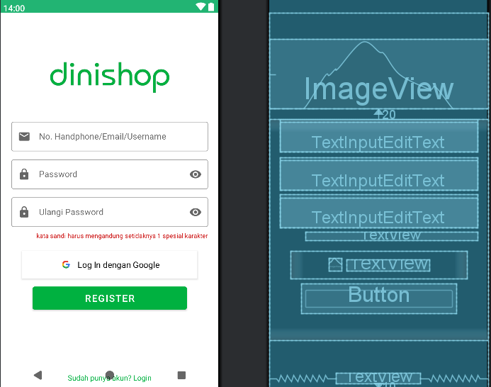
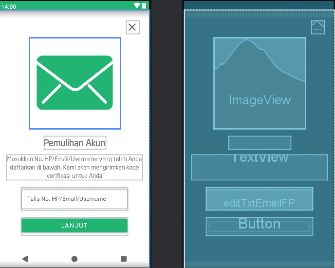
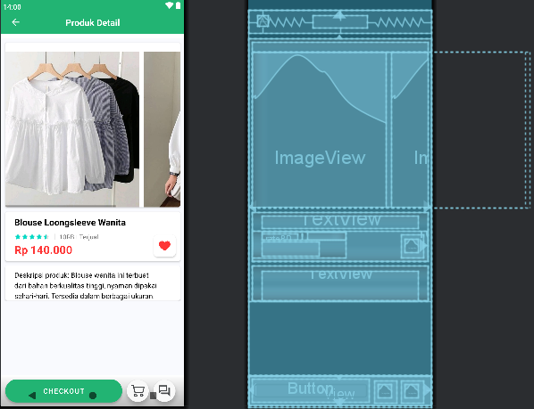

# Aplikasi Belanja Online menggunakan Android Studio (DINI SHOP)
Aplikasi android e-commerce yang ditulis dalam android studio di mana pengguna dapat membeli produk secara online. 

|  | |
| ----------- | ----------- |
| <b> Nama     | Dini Siti Masluhah       |
| <b> NIM     | 312310197       |
| <b> Kelas   | TI.23.C.3        |
| <b> Matakuliah   | Pemrograman Mobile        |

## Penjelasan
Aplikasi ini berisi daftar produk pakaian wanita seperti atasan wanita, celana wanita yang dapat diklik oleh pengguna untuk melihat detailnya dan kemudian menambahkannya ke keranjang. Pengguna juga dapat menyukai dan tidak menyukai produk. Selain itu, beberapa menu/tampilan yang tersedia adalah sebagai berikut:
- Login/Pendaftaran: Aplikasi ini memungkinkan pengguna untuk masuk menggunakan ponsel/email/nama pengguna dan kata sandi mereka, atau melalui akun Google mereka.
- Layar Beranda: Layar beranda menampilkan berbagai kategori produk dan spanduk untuk “Mega Sale” dengan barang-barang yang didiskon.
- Detail Produk: Halaman detail produk menampilkan gambar, deskripsi, dan harga untuk setiap produk, serta tombol “CHECKOUT”.
- Keranjang Belanja: Keranjang belanja atau layar “Keranjang Saya” berisi daftar item yang telah ditambahkan pengguna, dengan jumlah dan jumlah total pesanan. Layar ini juga menyertakan kolom untuk memasukkan voucher/kupon.
- Pembayaran: Meskipun tidak secara eksplisit ditampilkan dalam gambar, keberadaan tombol “CHECKOUT” menunjukkan bahwa aplikasi kemungkinan memiliki proses checkout untuk menyelesaikan pembelian.

## Fitur fitur yang digunakan dalam aplikasi ini juga beragam seperti : 
- Komponen UI: Aplikasi ini menggunakan elemen UI seluler yang umum seperti ImageView, TextInputEditText, Button, dan BottomNavigationView dalam desainnya.
- Recyclerview dengan ukuran rentang variabel untuk menampilkan produk.
- Bilah Pencarian dan tampilan flash sale produk
- Menambah/Mengurangi jumlah produk di keranjang.

## Beberapa screenshot menu yang terdapat pada aplikasi Dini Shop

|                 Daftar              |                Login              |        Forgot Password         |
| :---------------------------------: | :-------------------------------: | :------------------------------:|
|  |  |  |

|           Homepage/beranda          |             Detail Produk              |             Keranjang Saya             |
| :------------------------------: | :----------------------------------------: | :-------------------------------------:|
|  |  |  |

## Penjelasan Menu yang tersedia

1. Menu Register : Gambar tersebut menampilkan halaman registrasi dari aplikasi "Dinishop". Di bagian atas, terdapat logo "Dinishop", yang memperkenalkan aplikasi ini kepada pengguna. Halaman ini memiliki beberapa kolom input, termasuk kolom untuk mengisi "No. Handphone/Email/Username" dan "Password". Di bawah kolom password, terdapat petunjuk yang menyatakan bahwa password harus mengandung setidaknya satu karakter khusus, yang membantu pengguna dalam membuat password yang aman. Selain itu, terdapat kolom "Ulangi Password", yang mengindikasikan bahwa halaman ini merupakan proses pendaftaran dan bukan hanya login. Pengguna dapat melanjutkan proses registrasi dengan menekan tombol "REGISTER". Terdapat juga opsi untuk mendaftar menggunakan akun Google melalui tombol "Log In dengan Google". Di bagian bawah halaman, ada tautan "Sudah memiliki akun? Login", yang memberi akses bagi pengguna yang sudah terdaftar untuk masuk ke akun mereka.
Di sisi kanan gambar, terlihat mockup desain UI dengan berbagai elemen, seperti ImageView, TextInputEditText, Button, dan TextView, yang menggambarkan struktur dan tata letak halaman secara visual.

2. Menu Login : Gambar menunjukkan layar login dari aplikasi yang disebut “Dinishop”. Layar ini mencakup kolom untuk memasukkan “No. HP/Email/Nama Pengguna” dan “Kata Sandi”. Ada juga tautan “Lupa kata sandi?” (Lupa kata sandi?). Tombol “LOG IN” ditampilkan, bersama dengan opsi untuk “Masuk dengan Google”.
Gambar sebelah kanan menunjukkan desain UI dengan berbagai elemen UI, termasuk “ImageView”, “TextInputEditText”, “Button”, dan “TextView”. Ini tampaknya merupakan komponen UI yang digunakan dalam desain aplikasi Dinishop.

3.  Menu Reset ulang password : Gambar tersebut menampilkan layar pengaturan ulang kata sandi untuk aplikasi Dinishop, yang dirancang untuk membantu pengguna dalam proses pemulihan akun. Di bagian atas layar, terdapat ikon amplop hijau yang melambangkan proses "Pemulihan Akun". Sebuah pesan juga menjelaskan bahwa pengguna diminta untuk memasukkan nomor telepon, email, atau nama pengguna yang terdaftar, dan kode verifikasi akan dikirimkan untuk menyelesaikan proses pemulihan akun. Di bawah pesan tersebut, terdapat kolom input teks yang memungkinkan pengguna untuk memasukkan informasi yang diminta, seperti nomor telepon, email, atau nama pengguna mereka. Pengguna kemudian dapat melanjutkan proses dengan menekan tombol "LANJUT".
Bagian lain dari layar menunjukkan mockup desain UI dengan berbagai elemen, termasuk ImageView, TextInputEditText, dan Button, yang menggambarkan tampilan dan interaksi antarmuka pengguna.

4. Menu Homepage : Gambar tersebut menampilkan layar beranda dari aplikasi belanja seluler Dinishop, dengan elemen-elemen utama yang memudahkan pengguna dalam menjelajahi berbagai produk. Di bagian atas layar, terdapat iklan spanduk besar yang menampilkan promosi "Mega Sale" dengan diskon hingga 70%, menarik perhatian pengguna untuk melihat lebih lanjut. Di bawah iklan, kategori produk ditampilkan dalam bentuk display berupa gambar, mencakup berbagai pilihan seperti "Blus Wanita", "Jeans Wanita", "Sepatu Pria", "Baju Atasan Wanita", "Gamis Wanita", dan "Bawahan Wanita". Setiap kategori produk dilengkapi dengan harga dan harga diskon, memberikan informasi yang jelas tentang potongan harga yang ditawarkan. Di bagian atas layar juga terdapat bilah pencarian, memudahkan pengguna untuk mencari produk tertentu. Di bagian bawah, terdapat pilihan navigasi yang memungkinkan pengguna untuk berpindah antar halaman, seperti "Beranda", "Kategori", dan "Keranjang". 
Sisi kanan gambar menunjukkan mockup UI dengan berbagai elemen desain, termasuk SearchEditText, ImageView, dan BottomNavigationView, yang menggambarkan komponen-komponen antarmuka pengguna dalam aplikasi. Secara keseluruhan, gambar ini menggambarkan layar beranda utama Dinishop, yang mengintegrasikan kategori produk, penawaran diskon, dan fitur navigasi untuk pengalaman berbelanja yang mudah dan menarik.

5. Menu detail produk : Gambar tersebut menampilkan halaman detail produk untuk item "Blus Lengan Panjang Wanita" pada aplikasi Dinishop. Di bagian atas layar, terdapat korsel gambar yang memperlihatkan tampilan berbeda dari produk tersebut, memungkinkan pengguna untuk melihat lebih jelas berbagai sudut dan detail blus yang ditawarkan. Nama produk "Blus Lengan Panjang Wanita" dan harga (Rp 140.000) juga ditampilkan dengan jelas, memberikan informasi penting tentang produk yang sedang dipilih. Di bawah informasi harga, terdapat deskripsi produk yang memberikan rincian lebih lanjut mengenai bahan, ukuran, dan fitur lainnya. Untuk melanjutkan proses pembelian, pengguna dapat menekan tombol “CHECKOUT” yang terletak di bagian bawah layar.
Di sisi kanan gambar, terlihat mockup UI dengan elemen-elemen seperti ImageView, TextView, dan Button, yang menggambarkan struktur antarmuka pengguna aplikasi. Secara keseluruhan, halaman ini dirancang untuk memberikan informasi lengkap tentang produk blus lengan panjang wanita, mulai dari gambar, harga, hingga deskripsi, serta memudahkan pengguna untuk melanjutkan ke proses pembelian.

6. Menu Keranjang Saya : Gambar tersebut menampilkan layar "Keranjang Saya" dari aplikasi Dinishop, yang menunjukkan ringkasan barang-barang yang telah ditambahkan ke keranjang belanja. Terdapat tiga item produk dalam keranjang, yaitu blus “Batik Wanita”, celana “Jeans Wanita”, dan kaus “Hoodie Wanita”, masing-masing dilengkapi dengan jumlah dan harga yang sesuai. Pengguna dapat melihat harga per item serta jumlah yang telah dipilih. Di bagian bawah, terdapat kotak centang "Pilih Semua" (Select All), yang memungkinkan pengguna untuk memilih semua barang dalam keranjang secara bersamaan. Di bawah daftar item, ada kolom untuk memasukkan kode kupon, dengan kode yang terisi otomatis “HAPPYNEWYEAR2025”, yang dapat digunakan untuk mendapatkan diskon. Di bagian bawah layar, tertera jumlah total pesanan, yang dalam contoh ini adalah Rp 400.000, memberi informasi kepada pengguna mengenai total yang harus dibayar.
Di sisi kanan gambar, terlihat mockup UI yang mencakup elemen-elemen seperti ImageView, TextView, dan Button, menggambarkan struktur dan elemen interaktif dalam antarmuka pengguna. Secara keseluruhan, layar ini memberikan gambaran lengkap tentang barang-barang di keranjang belanja, memberi pengguna opsi untuk mengelola pembelian mereka, menerapkan voucher, dan melanjutkan ke proses pembayaran.

---
